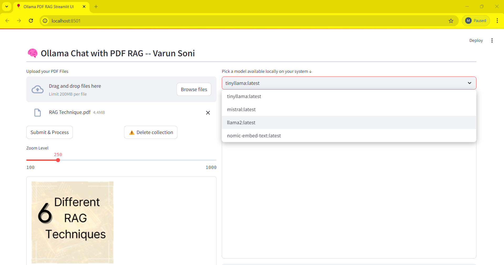
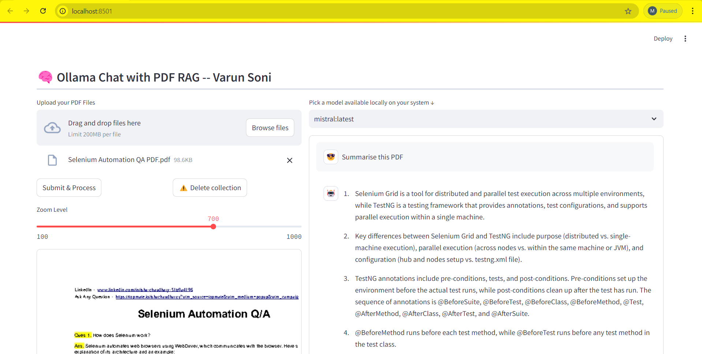
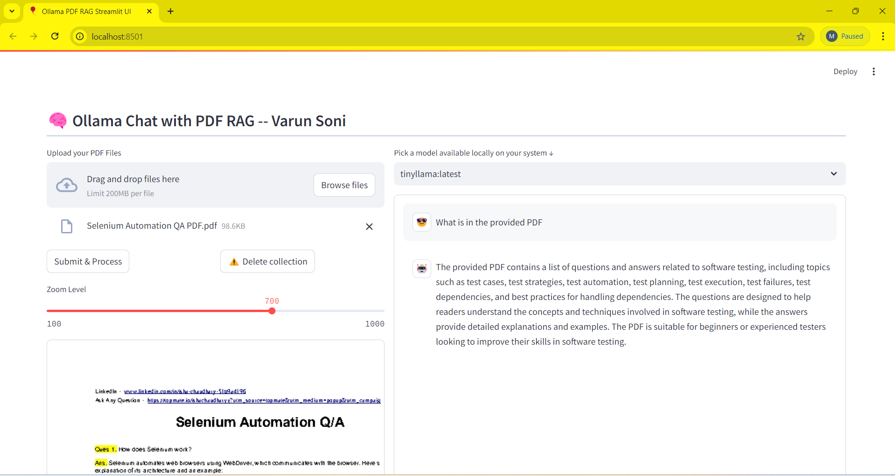

# Ollama PDF RAG Streamlit UI

## Overview

This application is a Retrieval-Augmented Generation (RAG) system that allows users to interact with PDF documents using natural language queries. It combines the power of local language models, efficient text embedding, and vector search to provide accurate and context-aware responses to user questions based on the content of uploaded PDFs.

## Model Available :



## Model Used : Mistral




## Model Used : tinyllama



## Features

- PDF upload and processing
- Question answering using local language models
- PDF viewer with zoom functionality
- Vector database for efficient information retrieval
- Multi-query retrieval for improved accuracy

## How It Works

1. **PDF Processing**: Users upload PDF documents which are then processed and converted into text.
2. **Text Embedding**: The extracted text is split into chunks and converted into vector embeddings.
3. **Vector Storage**: These embeddings are stored in a vector database for quick retrieval.
4. **Query Processing**: User questions are processed using a language model to generate multiple query variations.
5. **Retrieval**: Relevant text chunks are retrieved from the vector database based on the queries.
6. **Answer Generation**: The language model uses the retrieved context to generate an accurate answer.

## Components

### Language Models

We use the following Ollama models:

1. **LLaMA 2**: A powerful open-source language model developed by Meta AI, known for its strong performance across various NLP tasks.
2. **Mistral**: An efficient and high-performance language model, offering a good balance between speed and accuracy.

These models are used for question understanding, query generation, and answer synthesis.

### Embedding Model

- **Nomic Embed**: We use the `nomic-embed-text` model for generating text embeddings. This model is optimized for creating high-quality vector representations of text, which is crucial for accurate information retrieval.

### Vector Database

- **FAISS (Facebook AI Similarity Search)**: An efficient similarity search and clustering library for dense vectors. We use FAISS as our vector database due to its high performance and ability to handle large-scale datasets.

## Why These Components?

- **Local Language Models**: Using Ollama models allows for privacy-preserving, offline operation while maintaining high-quality language understanding and generation.
- **RAG System**: By combining retrieval with generation, we can provide answers that are both relevant to the user's question and grounded in the actual content of the PDFs.
- **Vector Embeddings and Search**: This allows for semantic understanding of both the document content and user queries, enabling more accurate and context-aware information retrieval.
- **Multi-Query Retrieval**: By generating multiple variations of the user's query, we increase the chances of finding relevant information, especially for complex or ambiguous questions.

## Prerequisites

Before running the application, make sure you have the following installed:

- Python 3.8 or higher
- [Ollama](https://ollama.ai/) - for running local language models

## Installation

1. Clone this repository:

   ```
   git clone https://github.com/varun-soni-ai/RAG-Ollama-Chat-with-PDF.git
   cd ollama-pdf-rag-streamlit
   ```
2. Create a virtual environment:

   ```
   python -m venv rag-ollama
   source rag-ollama/bin/activate  # On Windows, use `rag-ollama\Scripts\activate`
   ```
3. Install the required packages:

   ```
   pip install -r requirements.txt
   ```
4. Pull the required Ollama models:
   Make sure you have Ollama installed and running, then execute the following commands:

   ```
   ollama pull nomic-embed-text
   ollama pull llama2
   ollama pull mistral
   ollama pull tinyllama
   ```

   This will download and set up the necessary models for the application.

## Running the Application

1. Make sure Ollama is running on your system.
2. Start the Streamlit application:

   ```
   streamlit run app.py
   ```
3. Open your web browser and go to `http://localhost:8501` (or the URL provided by Streamlit).

## Usage

1. Select a local language model from the dropdown menu.
2. Upload one or more PDF files using the file uploader.
3. Click the "Submit & Process" button to process the PDFs.
4. Once processing is complete, you can view the PDF pages and adjust the zoom level.
5. Enter your questions in the chat input at the bottom of the page.
6. The system will provide answers based on the content of the uploaded PDFs.

## Troubleshooting

- If you encounter any issues with Ollama or the language models, make sure Ollama is properly installed and running on your system.
- Check that you have successfully pulled all required models (`nomic-embed-text`, `llama2`, `tinyllama` and `mistral`).
- Check the console output for any error messages or logs that might help identify the problem.
